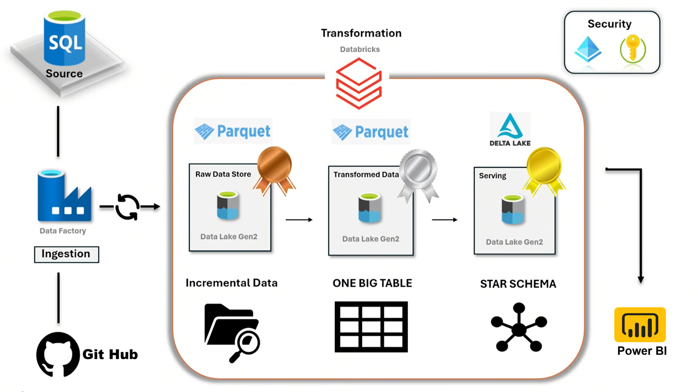

# Car Sales Analytics | Azure Data Engineering Project
## Introduction
This project focuses on building an end-to-end Azure data engineering pipeline for car sales data using Azure Data Factory for ingestion, Databricks for transformation, and Unity Catalog for governance. The data is modeled using a star schema with fact and dimension tables, implementing Slowly Changing Dimensions (SCD) to track historical changes. This solution enables scalable, well-governed, and analytics-ready data for reporting and insights.

## Architecture

## Technology Used
1. Programming Language : Python
2. Scripting Language : SQL
3. Azure
    - Data Factory
    - Azure Databricks
    - Azure SQL Database
    - Github
