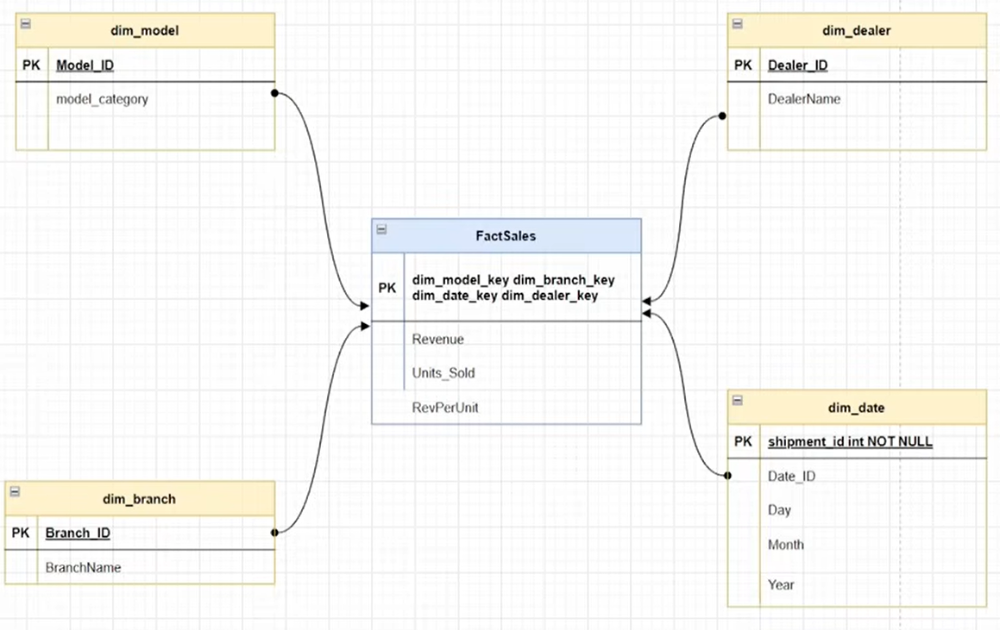

# Car Sales Analytics | Azure Data Engineering Project
## Introduction
This project focuses on building an end-to-end Azure data engineering pipeline for car sales data using Azure Data Factory for ingestion, Databricks for transformation, and Unity Catalog for governance. The data is modeled using a star schema with fact and dimension tables, implementing Slowly Changing Dimensions (SCD) to track historical changes. This solution enables scalable, well-governed, and analytics-ready data for reporting and insights.

## Architecture

## Summary

- Designed and implemented an end-to-end data engineering pipeline on Azure, processing raw data into analytics-ready datasets.
- Built scalable ETL pipelines using Azure Data Factory with batch and incremental data ingestion strategies.
- Developed data transformation workflows using Azure Databricks and PySpark, including joins, aggregations, and data cleansing.
- Implemented Medallion Architecture (Bronze–Silver–Gold) to structure data processing layers and improve data reliability.
- Modeled data using Star Schema design, enabling optimized querying and reporting.
- Applied Slowly Changing Dimensions (SCD) techniques for handling historical data changes.
- Managed data governance and access control using Unity Catalog in Databricks.
- Stored and processed large datasets using Delta Lake for improved performance and reliability.

## Technology Used
1. Programming Language : Python
2. Scripting Language : SQL
3. Azure
    - Data Factory
    - Azure Databricks
    - Azure SQL Database
    - Github
      
## Dataset used

- Initial Load Data [SalesData.csv](SalesData.csv)
- Incremental Load Data [IncrementalSales.csv](IncrementalSales.csv)

## Data Model

## Project Script

1. [Create Catalog and schema](db_notebook.ipynb)
2. [Silver layer](Silver_notebook.ipynb)
3. 
